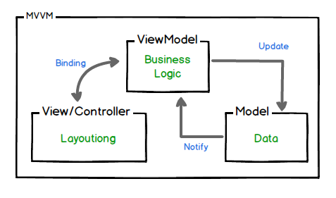

# SimpleMVVMExample

In current example binded by closures, as most common approach but also can be binded by:

+ Delegates & Protocols
+ Swift Combine
+ KVO based binding libraries (RZDataBinding, SwiftBond, ..)
+ Functional reactive libraries (ReactiveCocoa, RxSwift, PromiseKit, ..)
